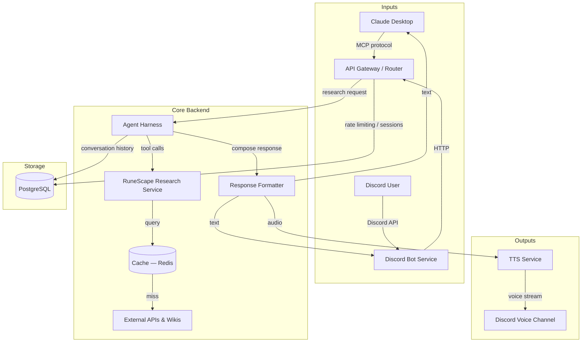
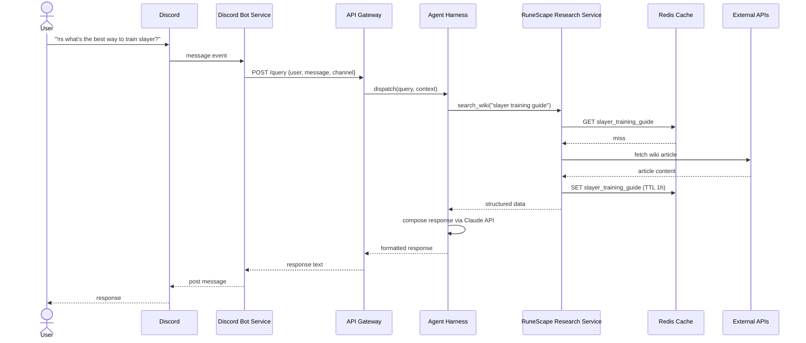
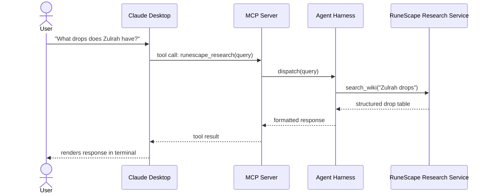

# Architecture — RuneScape Research Assistant

## System Overview

---

## Service Breakdown

### 1. API Gateway / Router
- Single entry point for all requests
- Handles auth tokens, rate limiting, request validation
- Routes to Agent Harness
- Technology: **nginx** (reverse proxy) + lightweight **FastAPI** or **Express** router

### 2. Agent Harness
- Orchestrates the research workflow using Claude API (tool use)
- Manages conversation context per user/session
- Calls RuneScape Research Service tools as needed
- Returns structured response to formatter
- Technology: **Python** + Anthropic SDK with tool use

### 3. RuneScape Research Service
- Exposes tools the agent can call:
  - `search_wiki(query)` — searches RS/OSRS wiki
  - `get_item_price(item_name)` — GE price lookup
  - `get_player_stats(username)` — hiscores lookup
  - `get_quest_info(quest_name)` — quest details
- Caches results in Redis (TTL varies by data type)
- Technology: **Python** microservice

### 4. Discord Bot Service
- Listens for mentions or slash commands in Discord servers
- Sends queries to API Gateway
- Posts formatted text responses back to channel
- Joins voice channel and streams TTS audio when requested
- Technology: **discord.py** or **discord.js**

### 5. TTS Service
- Receives text response
- Returns audio stream for Discord voice
- Technology: **Google TTS**, **ElevenLabs**, or **AWS Polly** (TBD)

### 6. Cache (Redis)
- Caches GE prices (TTL: 5 min)
- Caches wiki lookups (TTL: 1 hour)
- Caches hiscores (TTL: 10 min)

### 7. Database (PostgreSQL)
- Conversation history per user
- User preferences (OSRS vs RS3, voice on/off)
- Rate limit counters
- API usage tracking

---

## Request Flow — Discord Text Query

---

## Request Flow — Claude Desktop Query

---

## Claude Desktop Integration Options

| Option | How it works | Complexity |
|--------|-------------|------------|
| **MCP Server** | Claude Desktop calls a locally-running MCP server; server proxies to backend | Medium — requires MCP server process |
| **API Proxy** | Claude Desktop configured with a custom API endpoint pointing to our gateway | Low — just config, no extra process |
| **Standalone Agent** | Claude Code CLI runs the agent harness directly | Low — no server needed for dev |

**Recommendation:** MCP Server for production (clean separation), API Proxy or CLI for dev.

---

## Environment Differences

| Aspect | Dev | Production |
|--------|-----|------------|
| Hosting | Local or single small VPS | Multi-service VPS or cloud |
| Domain | `localhost` / dev subdomain | `runeassist.gg` (or chosen domain) |
| TLS | Self-signed / none | Let's Encrypt via Caddy |
| Discord Bot | Separate dev bot token + test server | Production bot token |
| Claude API | Same key, lower rate limits | Higher tier key |
| Redis | Local instance | Managed Redis or containerized |
| PostgreSQL | Local instance | Managed DB or containerized |
| Logging | stdout | Structured logs + log aggregation |
