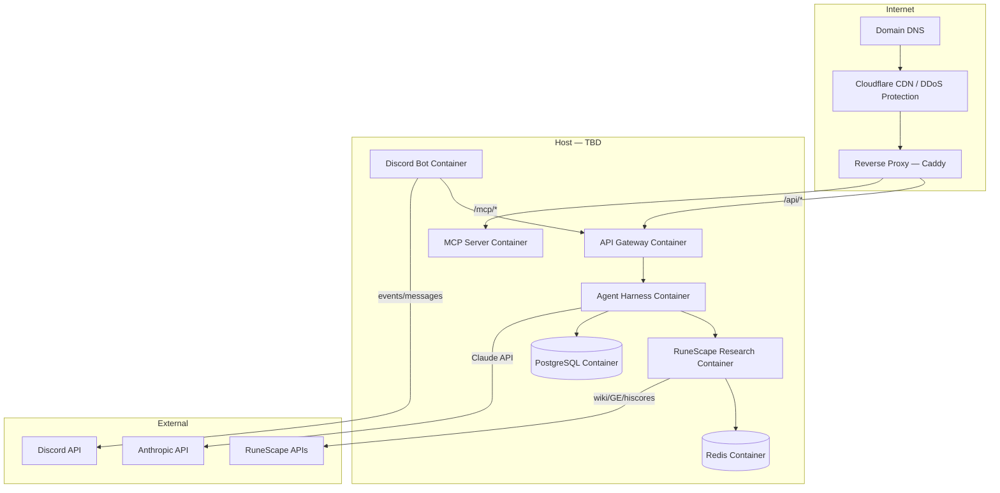

# Infrastructure — RuneScape Research Assistant

## Environments

### Dev Environment
- **Purpose:** Local development and testing throughout Phase 1–3
- **Setup:** Docker Compose — all services run locally (requires Colima on Linux)
- **Discord:** Separate bot application with a private test server
- **Domain:** None required. If a local reverse proxy is needed to expose the service
  on the home network, the hostname will be `reldo` (after the Varrock Palace librarian).
- **Secrets:** `.env` file (never committed — enforced by secrets-check hook)

### Production Environment
Production hosting decisions are deferred until the full stack (including Discord bot)
is complete and working. No cloud provider has been chosen.

---

## Server Architecture (target — full stack)



---

## Caching Strategy

**Phase 1 (MCP server only):** In-memory caching using a dict or `cachetools`.
No Redis. Cache is lost on restart, which is acceptable for a single dev process.

All caching must sit behind a thin interface (e.g. `get_cached(key)` / `set_cached(key, value, ttl)`)
so the backend can be swapped to Redis without touching tool logic.

**Redis TTL targets (for when Redis is introduced):**

| Data type | TTL |
|-----------|-----|
| GE prices | 5 min |
| Wiki lookups | 1 hour |
| Hiscores | 10 min |

---

## Reverse Proxy — Caddy (when needed)

Caddy handles TLS automatically via Let's Encrypt. Example routing for production:

```
reldo {
    reverse_proxy /api/*     api-gateway:8000
    reverse_proxy /mcp/*     mcp-server:8001
}
```

---

## Docker Compose Structure (Dev + Prod)

```
docker-compose.yml           ← base (shared config)
docker-compose.dev.yml       ← dev overrides (volume mounts, hot reload)
docker-compose.prod.yml      ← prod overrides (restart policies, resource limits)
```

Services:
```
services:
  api-gateway
  agent-harness
  runescape-research
  discord-bot
  tts-service
  mcp-server
  redis
  postgres
  caddy          (prod only)
```

---

## Secrets Management

| Environment | Method |
|-------------|--------|
| Dev | `.env` file (git-ignored, enforced by secrets-check hook) |
| Production | Docker secrets or environment variables via `.env.prod` (never in repo) |

Secrets required:
- `ANTHROPIC_API_KEY`
- `DISCORD_BOT_TOKEN`
- `TTS_API_KEY`
- `POSTGRES_PASSWORD`
- `REDIS_PASSWORD`
