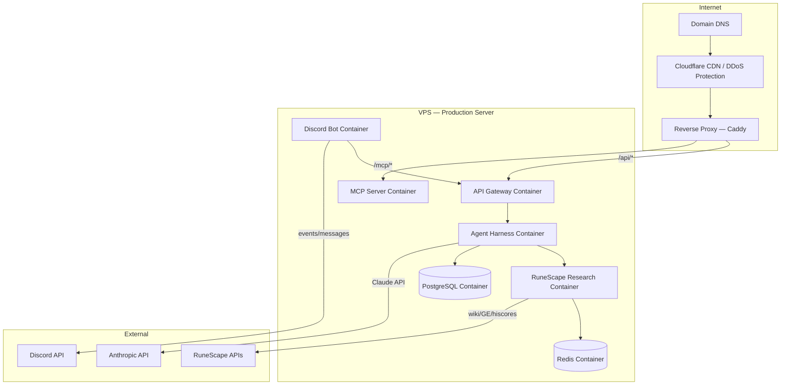

# Infrastructure — RuneScape Research Assistant

## Environments

### Dev Environment
- **Purpose:** Local development and testing
- **Setup:** Docker Compose — all services run locally
- **Discord:** Separate bot application with a private test server
- **Domain:** `localhost` or `dev.runeassist.gg` (behind ngrok or Cloudflare tunnel for webhook testing)
- **Secrets:** `.env` file (never committed — enforced by secrets-check hook)

### Production Environment
- **Purpose:** Public-facing, always-on
- **Setup:** VPS with Docker Compose or managed containers
- **Domain:** Custom domain (e.g. `runeassist.gg`) with SSL
- **Discord:** Production bot token, live server(s)
- **Secrets:** Environment variables injected at runtime via secret manager

---

## Server Architecture



---

## Hosting Options

| Provider | Type | Notes |
|----------|------|-------|
| **DigitalOcean Droplet** | VPS | Simple, predictable cost, good for small scale |
| **Linode / Akamai** | VPS | Similar to DO, slightly cheaper |
| **Hetzner** | VPS | Very cheap EU-based, great value |
| **AWS EC2** | Cloud VM | More complex, scales well, higher cost |
| **Fly.io** | Container PaaS | Easy multi-region, good free tier |

**Recommendation for v1:** DigitalOcean Droplet ($12–24/mo) — simple, well-documented,
easy to scale to larger instance or add managed DB/Redis later.

---

## Reverse Proxy — Caddy

Caddy handles TLS automatically via Let's Encrypt. Example routing:

```
runeassist.gg {
    reverse_proxy /api/*     api-gateway:8000
    reverse_proxy /mcp/*     mcp-server:8001
}
```

---

## Domain Name

- Register via **Namecheap**, **Cloudflare Registrar**, or **Google Domains**
- Point DNS to VPS IP
- Cloudflare in front for DDoS protection, caching, and free SSL at edge
- Suggested names (availability TBD):
  - `runeassist.gg`
  - `rsresearch.app`
  - `gielinor.ai`
  - `runebot.gg`

---

## Docker Compose Structure (Dev + Prod)

```
docker-compose.yml           ← base (shared config)
docker-compose.dev.yml       ← dev overrides (volume mounts, hot reload)
docker-compose.prod.yml      ← prod overrides (restart policies, resource limits)
```

Services:
```
services:
  api-gateway
  agent-harness
  runescape-research
  discord-bot
  tts-service
  mcp-server
  redis
  postgres
  caddy          (prod only)
```

---

## Secrets Management

| Environment | Method |
|-------------|--------|
| Dev | `.env` file (git-ignored, enforced by secrets-check hook) |
| Production | Docker secrets or environment variables via `.env.prod` (never in repo) |

Secrets required:
- `ANTHROPIC_API_KEY`
- `DISCORD_BOT_TOKEN`
- `TTS_API_KEY`
- `POSTGRES_PASSWORD`
- `REDIS_PASSWORD`

---

## Estimated Monthly Cost (v1 Production)

| Item | Estimated Cost |
|------|---------------|
| VPS (DigitalOcean 2vCPU / 4GB) | $24/mo |
| Domain name | ~$12/yr |
| Cloudflare (free tier) | $0 |
| Anthropic API | Usage-based (~$10–30/mo) |
| TTS API | Usage-based (~$5–15/mo) |
| **Total** | **~$40–70/mo** |
